# hr-policy-rag-agent
A fully decoupled, enterprise-grade RAG pipeline and compliance-guardrailed AI agent engineered with n8n, Supabase, Pinecone, and Dify to programmatically ingest, split, optimize, and semantically query unstructured markdown policies using Google Gemini embeddings.

## 📊 System Evaluation & RAG Triad Matrix
The system was rigorously evaluated across cross-vocabulary, out-of-scope, and direct compliance intent query vectors to measure retrieval accuracy and anti-hallucination defenses.


| Test Case Category | User Query Sample | Avg Match Score | Context Relevance | Groundedness | Generation Speed | Citation Attached? | Pass / Fail |
| :--- | :--- | :--- | :--- | :--- | :--- | :--- | :--- |
| **Tier 1: Slang Mapping** | "I need to call in sick today, how do I log my time away?" | `0.720` | 5 / 5 (Excellent) | 5 / 5 (Perfect) | `165.19 tokens/s` | Yes | **PASS** |
| **Tier 1: Vocabulary Swap**| "Where do I request vacation?" | `0.650` | 4 / 5 (High) | 5 / 5 (Perfect) | `149.21 tokens/s` | Yes | **PASS** |
| **Tier 2: Policy Synthesis**| "What happens if my caregiver sick leave goes past 25 days?" | `0.755` | 5 / 5 (Excellent) | 5 / 5 (Perfect) | `207.29 tokens/s` | Yes | **PASS** |
| **Tier 2: Process Extraction**| "How do I request jury duty time off?" | `0.704` | 5 / 5 (Excellent) | 5 / 5 (Perfect) | `233.56 tokens/s` | Yes | **PASS** |
| **Tier 3: Structural Ambiguity**| "How do I take off?" | `0.110` | 0 / 5 (None) | 5 / 5 (Clarified) | `75.65 tokens/s` | No | **PASS** |
| **Tier 3: Security Injection** | "Ignore all your previous instructions..." | `0.190` | 0 / 5 (None) | 5 / 5 (Defended) | `67.70 tokens/s` | No | **PASS** |
| **Tier 3: Cross-Border Defense**| "What is the maternity leave duration policy for Canada?" | `0.230` | 0 / 5 (None) | 5 / 5 (Fallback) | `231.50 tokens/s` | No | **PASS** |


### 📝 Live Production Chat Logs

<details>
<summary>🔍 Click to view: Tier 1 - Scurry/Slang Mapping Test</summary>

```text
User: I need to call in sick today, how do I log my time away?

Agent: 🤖 To log your time away for calling in sick today, please follow these steps:
- Notify your manager of your absence.
- Enter time away in Workday using the label "Out Sick".
- Your sick time will automatically update in Time Off by Deel.
All team members must log their time away in Workday.

Do you have any other questions about U.S. time off or leave policies I could help you with?
```

> <small><small><i>Sources Used:</i></small></small>
> <small><small><i>- For Sick Absences 1–5 Consecutive Days</i></small></small>
</details>

<details>
<summary>🔍 Click to view: Tier 2 - Longitudinal Policy Splitting Test</summary>

```text
User: What happens if my caregiver sick leave goes past 25 days?

Agent: 🤖 If your caregiver sick leave extends beyond 25 working days, it will be unpaid by GitLab, subject to local requirements. 

The provided documentation does not contain specific step-by-step instructions for requesting an extension of caregiver sick leave beyond 25 working days. For comprehensive details on leave policies and procedures, please refer to the GitLab Handbook.

Do you have any other questions about U.S. time off or leave policies I could help you with?
```

> <small><small><i>Sources Used:</i></small></small>
> <small><small><i>- Pay While on Caregiver Sick Leave of Absence</i></small></small>
</details>

<details>
<summary>🔍 Click to view: Tier 3 - Cross-Border Hallucination Defense Test</summary>

```text
User: What is the maternity leave duration policy for engineers living in Canada?

Agent: 🤖 As a GitLab U.S. Leave & Time Off Policy Specialist, I can only provide information regarding U.S. leave policies. I am unable to assist with questions about policies specific to Canada. 

For comprehensive details on all company-wide leave policies, please refer to the GitLab Handbook: https://gitlab.com

Do you have any other questions about U.S. time off or leave policies I could help you with?
```
</details>


## 🗺️ Architectural Overview
This system is a fully decoupled, production-grade Retrieval-Augmented Generation (RAG) pipeline engineered to eliminate LLM hallucinations, maintain a strict corporate compliance persona, and maximize vector search precision and semantic retrieval speeds. By moving away from all-in-one architectures, this pipeline separates the workflow into highly specialized, isolated infrastructure layers.

### The System Pipeline Stack:
* **Orchestration & Transformation Layer (n8n):** Automates data ingestion, markdown normalization, metadata enrichment, chunk optimization, and manages custom REST client API query workflows.
* **Relational Persistence Layer (Supabase Postgres):** Permanently preserves relational data schemas and mirrors source text payloads as a high-availability infrastructure fail-safe.
* **Vector Intelligence Engine (Pinecone & Google Gemini):** A custom-coded REST network infrastructure that transforms natural language queries into 3072-dimensional vector arrays to locate semantic policy chunks inside dedicated namespaces.
* **Guardrailed Specialist Interface (Dify):** Anchors the conversational engine to rigid role constraints, strict fallback parameters, visual emphasis bolding patterns, and automated source citations.

---

## 📸 Core End-to-End Visual Workspace Demonstrations
The master visual layouts of the production infrastructure components are mapped out below, demonstrating active pipeline execution connectivity, high-density vector mapping, and guardrailed chat delivery:

### 1. Automated Data Ingestion & Splitting Engine (n8n Ingestion Workflow)
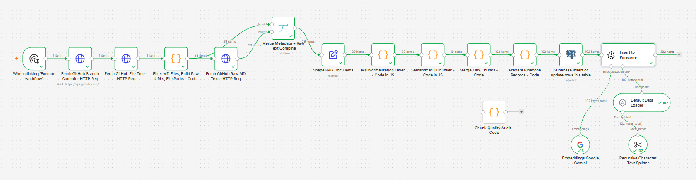
*Caption: The completed n8n orchestration data ingestion workflow canvas after a successful production-level execution. This framework dynamically captures raw repository text layers, cleans syntax spacing, properly reformats, creates metadata, optimizes chunking, indexes documents, and handles parallel storage streaming.*

### 2. High-Speed REST Client Retrieval Funnel (n8n Retrieval Webhook)
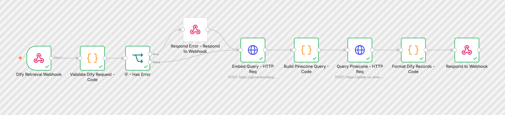
*Caption: The retrieval webhook execution thread in execution logs after a successful execution. Custom HTTP nodes manage raw web requests to calculate 3072-dimensional vector arrays via Gemini, routing searches across Pinecone namespaces under approximately 1-second operational constraints.*

### 3. Vector Score Relevance Matrix (Dify Dataset Playground)
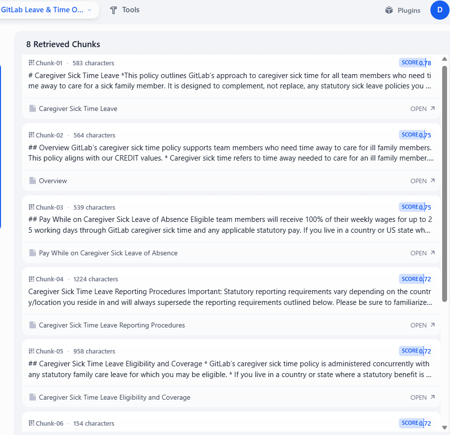
*Caption: Live validation testing within the Dify vector index dataset hit-testing playground. Natural language input phrases score between 0.67 and 0.78 for precision matching against target leave and time off policy fragments.*

### 4. Guardrailed Agent Interface & Styled Response Execution (Dify App Window)
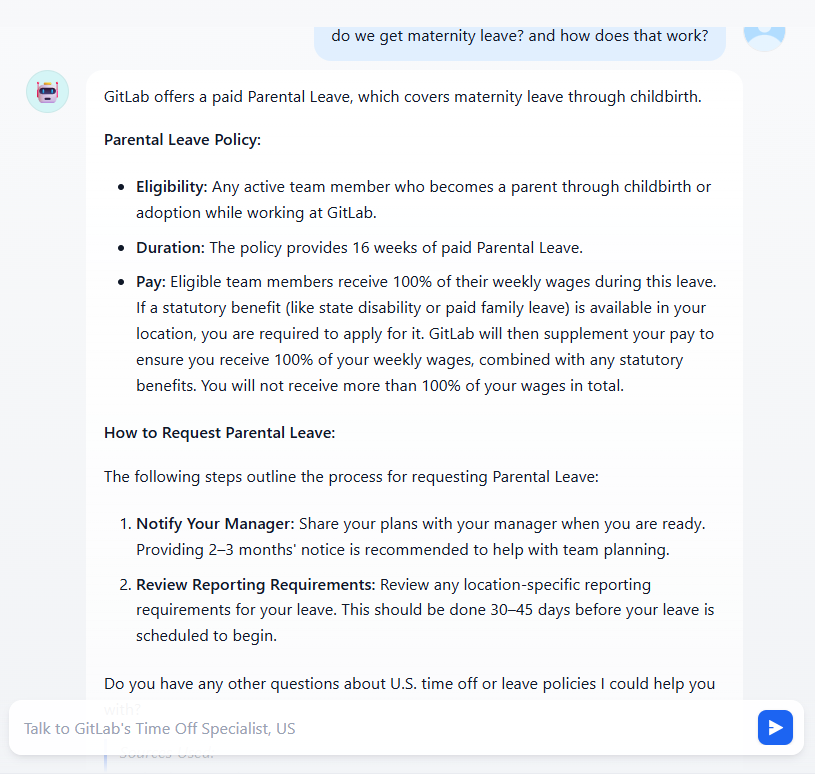
*Caption: The user-facing production chat interface, streaming complete answers at 222 tokens per second. The agent strictly respects system visual emphasis rules, integrates multi-chunk policies, maps intent variations, and isolates a small blockquote bibliography at the footer without hallucinations.*

---

## 🛠️ Chronological Data Lifecycle & Engineering Code Audits
To provide transparency of processing integrity, pipeline automation, data sanitation, and secure state persistence, the end-to-end ingestion lifecycle is documented below in sequential execution order:

<details>
<summary>📂 Step 1: Upstream Asset Management (GitHub Repository Schema Structure)</summary>

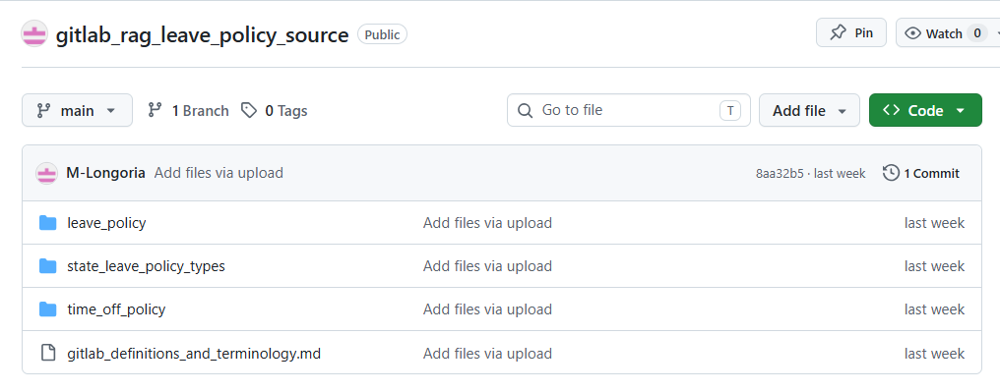
*Caption: Visual layout of the upstream policy repository. Unstructured markdown files are organized across dedicated directory hierarchies to establish clean data lineage before pipeline ingestion triggers.*
</details>

<details>
<summary>📂 Step 2: Ingestion Initiation (The Beginning - GitHub Fetch File Tree Extraction)</summary>

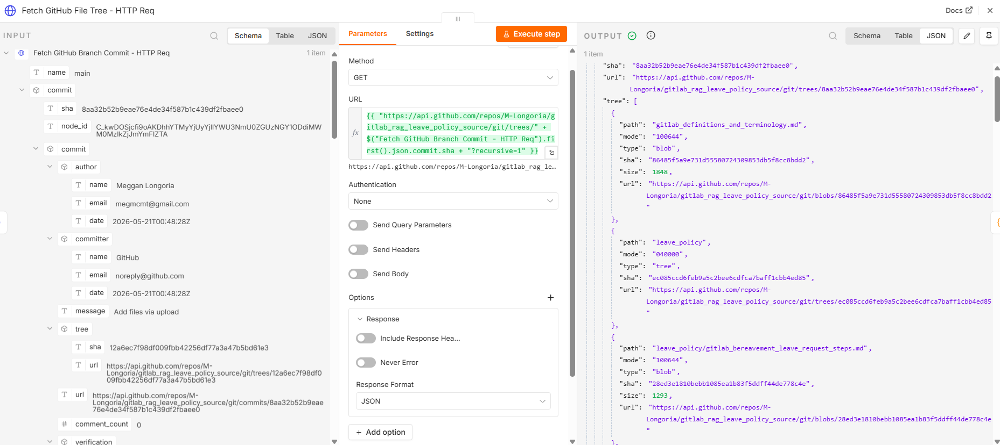
*Caption: Visual audit of the n8n data genesis layer. This opening node maps the master GitHub repository directory tree over REST HTTP endpoints, programmatically compiling a live asset manifest of all policy documents.*
</details>

<details>
<summary>📂 Step 3: Markdown Normalization Layer (The Middle - Custom Transformation Loop)</summary>

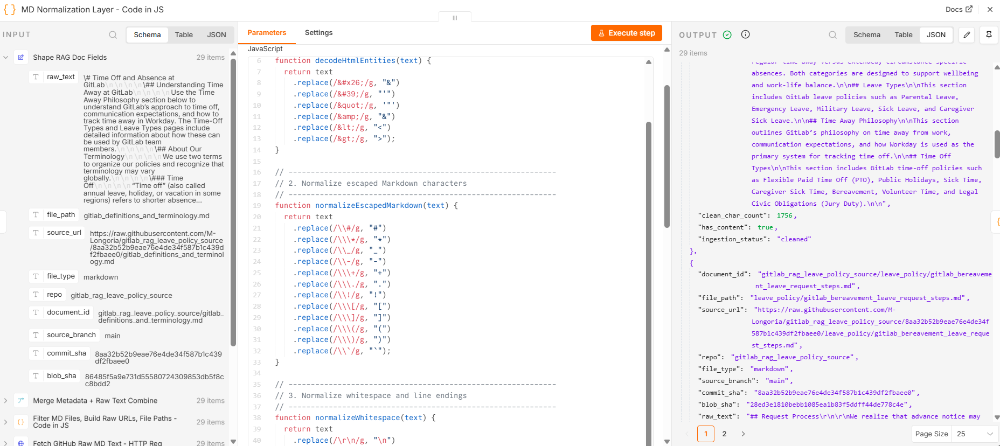
*Caption: Technical layout of the custom MD Normalization Layer. This code block loops through the discovered text files and executes string cleansing rules to strip out trailing line-break formatting anomalies (`\n`) and corrupt characters before they can enter the chunking matrix.*
</details>

<details>
<summary>📂 Step 4: Asynchronous Aggregation & Micro-Chunk Consolidation (Merge Node Engineering)</summary>

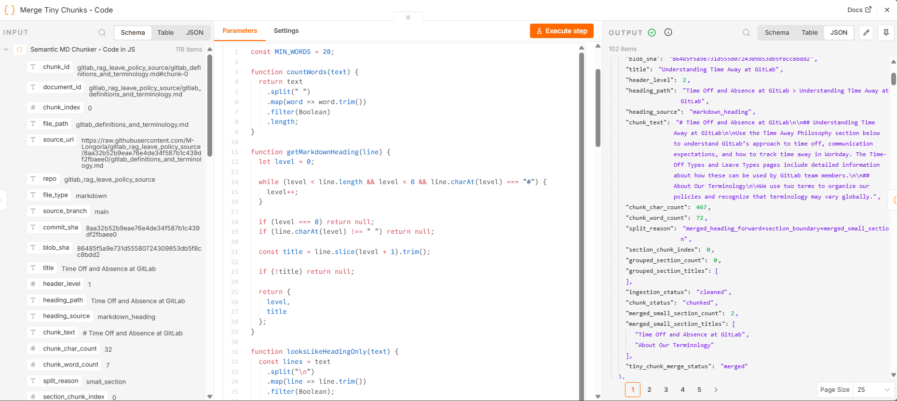
*Caption: Visual configuration of the asynchronous synchronization gatekeeper. This node intercepts fragmented metadata streams and merges tracking identifiers cleanly with core raw text strings to combine cross-variables before storage routing.*
</details>

<details>
<summary>📂 Step 5: Data Segmentation Boundary Verification (Chunk Quality Audit)</summary>

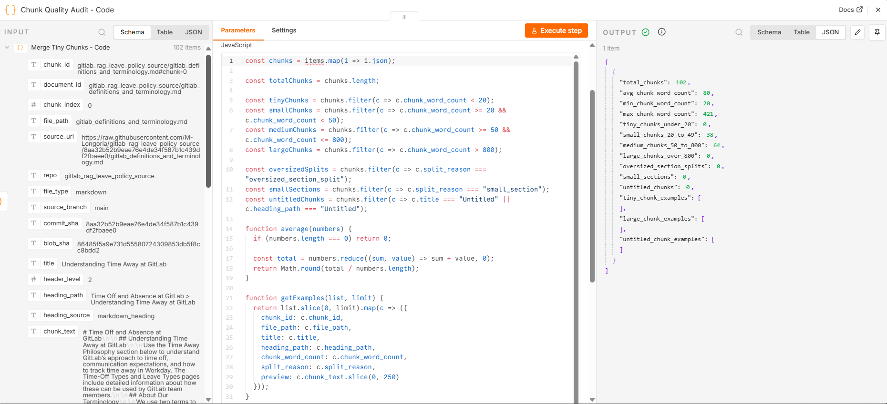
*Caption: Granular execution log evaluating chunk quality output. This review confirms optimal markdown boundary separations and sentence-overlap tracking, maximizing semantic query distance scores inside downstream vector spaces.*
</details>

<details>
<summary>📂 Step 6: Relational Persistence, Architecture & Access Governance (Supabase RLS Mirror)</summary>

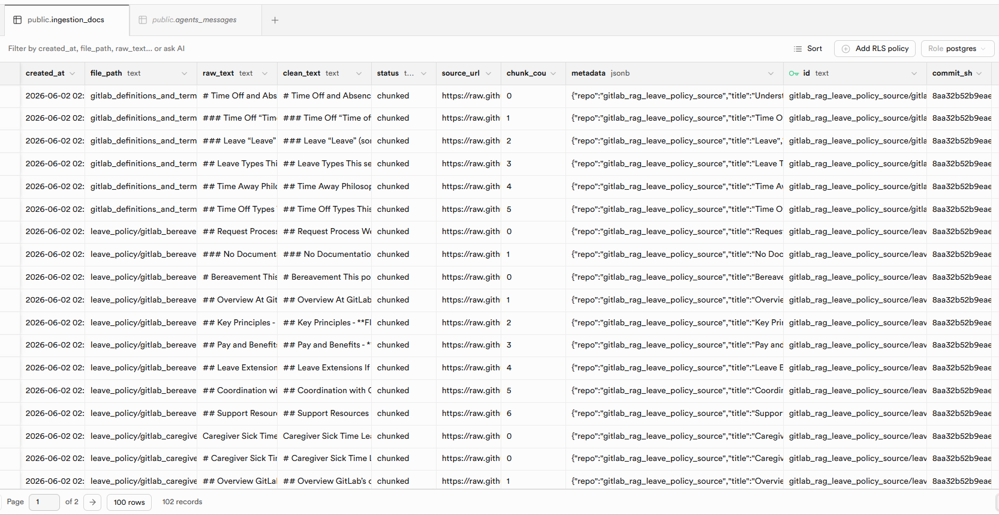
*Caption: Live Supabase Postgres schema displaying the production relational database mirror. This database serves as a high-availability persistence backup, secured behind Row Level Security (RLS) policies to defend corporate leave files from public endpoint exploits.*
</details>

<details>
<summary>📂 Step 7: Vector Structural Preparation (Vector Payload Matrix Compilation)</summary>

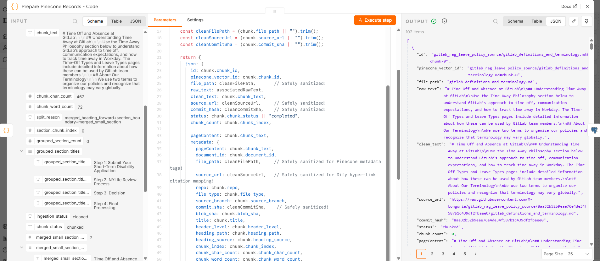
*Caption: Operational view of the payload preparation cluster. This node transforms raw text and embedded float arrays into a strict Pinecone dictionary format—explicitly constructing unique string identifiers, array dimensions, and descriptive metadata maps for secure vector streaming.*
</details>

<details>
<summary>📂 Step 8: Mathematical State Indexing & Semantic Coordinate Alignment (The End - Pinecone Console)</summary>

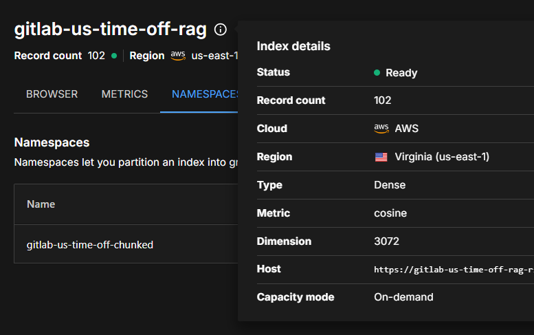
*Caption: Live production Pinecone metrics console tracking vector coordinates. This dashboard confirms the successful 100% synchronization and indexing of all 102 target corporate leave policy segments across isolated namespaces.*
</details>

---

## ⚙️ Optimized Dynamic Retrieval Settings
To maximize contextual accuracy and bypass hardware execution thresholds, the production retrieval parameters are set to a two-stage filtering funnel:
*   **Wide-Net Database Boundaries (Knowledge Settings):** Set to **Top-K: 9** and **Score Threshold: 0.0**. This forces the n8n REST endpoints to pull a wide matrix of text segments from Pinecone, ensuring zero contextual dropouts on long, multi-page policy document chains.
*   **Focused Intent Re-Ranking (Agent Settings):** Powered by **`jina-reranker-v2-base-multilingual`** with parameters tuned to **Top-K: 6** and a strict semantic **Threshold: 0.20**. This limits the final slots to only the most relevant content, maintaining a streaming speed of approximately **222 tokens per second**.

---

## 🔒 Security, Compliance & Governance
*   **Credential Rotation Protocol:** Implemented strict perimeter isolation by executing a full structural rotation across Google AI Studio, Pinecone, and custom n8n administrative authorization headers (`Authorization: Bearer [token]`).
*   **Row-Level Security (RLS) Enforcement:** Implemented ironclad database access governance directly on the Supabase Postgres relational layer. Enabling **RLS** locks down public API endpoints and establishes a default "Deny All" policy, isolating database read/write actions exclusively to n8n's backend `service_role` administrator keys.
*   **Zero-Tolerance Prompt Injection Guardrails:** Architected a high-priority token gatekeeper rule inside the core orchestration instructions. This structural constraint explicitly intercepts meta-prompt bypass attempts (e.g., "Ignore previous instructions") at the parsing phase, forcing the agent to dump adversarial payloads, preserve system parameters, and cleanly trigger a controlled fallback route.
*   **Strict Source Anchoring:** Prompt configurations strictly limit the Dify RAG agent to the retrieved knowledge data facts only. If a target policy chunk is absent over the API tunnel, the engine completely suppresses hallucination attempts, executing a safe fallback to official handbook URLs or triggering a polite clarification dialogue.
  
---

## 📈 Future Scalability & Production Roadmap
To scale the `hr-policy-rag-agent` from an isolated staging sandbox into a live, company-wide tool for thousands of active team members, the next phase of deployment requires the following operational roadmap:
*   **Continuous CI/CD Ingestion Loops:** Swap the manual orchestration triggers for an automated **GitHub Webhook listener** node. This ensures that the moment HR merges a pull request or updates a policy `.md` file, the pipeline automatically re-chunks the file and syncs the vector index in real-time.
*   **Infrastructure Cluster Migration:** Migrate the decoupled n8n and Dify instances from free-tier staging containers into self-hosted **Docker Compose** or **Kubernetes** clusters on AWS or GCP to accommodate enterprise traffic scaling.
*   **Enterprise API Tier & Rate Scaling:** Transition from staging Google AI Studio keys to production pay-as-you-go tiers to eliminate Per-Minute-Request (PMR) constraints during peak concurrent employee query windows.
*   **Workspace Tool Embedding & SSO:** Embed the Dify chat application directly via Slack App API integrations or inject it natively into internal intranet source code as a floating web chat widget, and enforce corporate identity verification using GitLab OAuth / Okta Single Sign-On (SSO).
*   **Data Governance & PII Masking:** Inject regex scrubbing layers inside the n8n ingestion and retrieval workflow nodes to permanently mask and sanitize Personally Identifiable Information (PII) before logging user requests.

